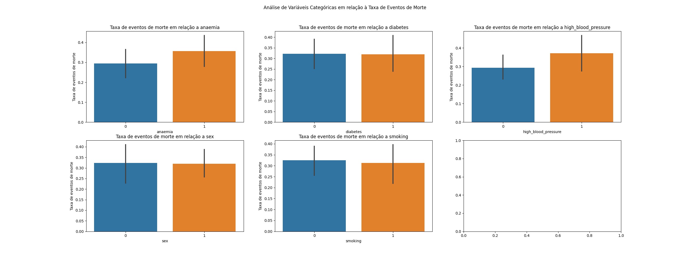
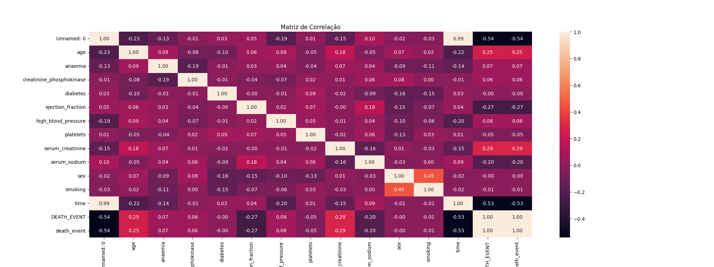
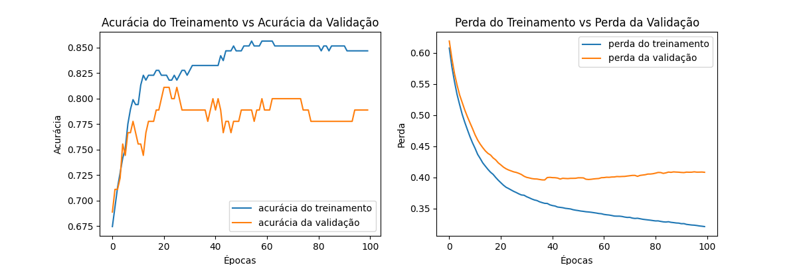

# Análise de Dados e Modelagem de Previsão de Insuficiência Cardíaca

Este projeto aborda a exploração de um conjunto de dados específico para insuficiência cardíaca e a implementação de um modelo de Machine Learning para prever a ocorrência de eventos de morte.

O projeto envolve as seguintes etapas e ferramentas:

- Manipulação de dados com a biblioteca **Pandas**
- Visualização de dados com as bibliotecas **Seaborn** e **Matplotlib**
- Pré-processamento de dados, incluindo codificação de rótulos e normalização de colunas numéricas
- Divisão de dados em conjuntos de treinamento e teste
- Criação e treinamento de uma rede neural profunda usando a biblioteca **Keras**
- Avaliação do modelo e geração de um relatório de classificação

## Análise Exploratória de Dados (EDA)

Nesta fase, o conjunto de dados é carregado utilizando o **Pandas**, variáveis categóricas são transformadas usando `LabelEncoder` e variáveis numéricas são convertidas para inteiros. Procedemos então com a EDA, iniciando com a criação de gráficos de barras para variáveis categóricas para analisar a taxa de eventos de morte para cada categoria. 

Prosseguimos então com a criação de uma matriz de correlação para visualizar as relações entre as variáveis numéricas.

## Modelagem de Previsão

Os dados são divididos em conjuntos de treinamento e teste e a normalização `StandardScaler` é aplicada nas variáveis numéricas. Em seguida, construímos uma rede neural usando a biblioteca **Keras**, com uma camada de entrada, uma camada oculta (com função de ativação 'relu') e uma camada de saída (com função de ativação 'softmax'). O modelo é compilado com `Categorical Cross-Entropy Loss`, otimizador 'Adam' e métrica 'accuracy'.

Após o treinamento do modelo por 100 épocas, avaliamos a acurácia nos dados de teste e geramos um relatório de classificação para uma visão mais detalhada do desempenho do modelo.

A acurácia e a perda durante o treinamento são visualizadas através de gráficos para avaliar o desempenho do modelo ao longo do tempo e identificar potenciais problemas, como overfitting ou underfitting.

